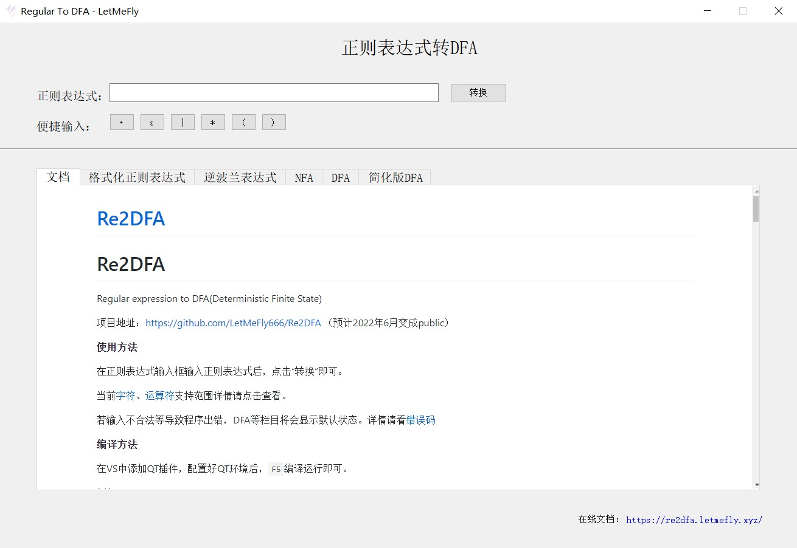
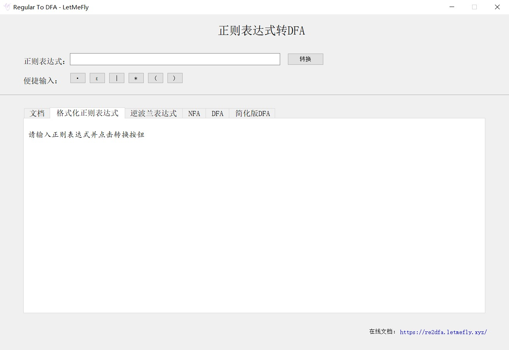
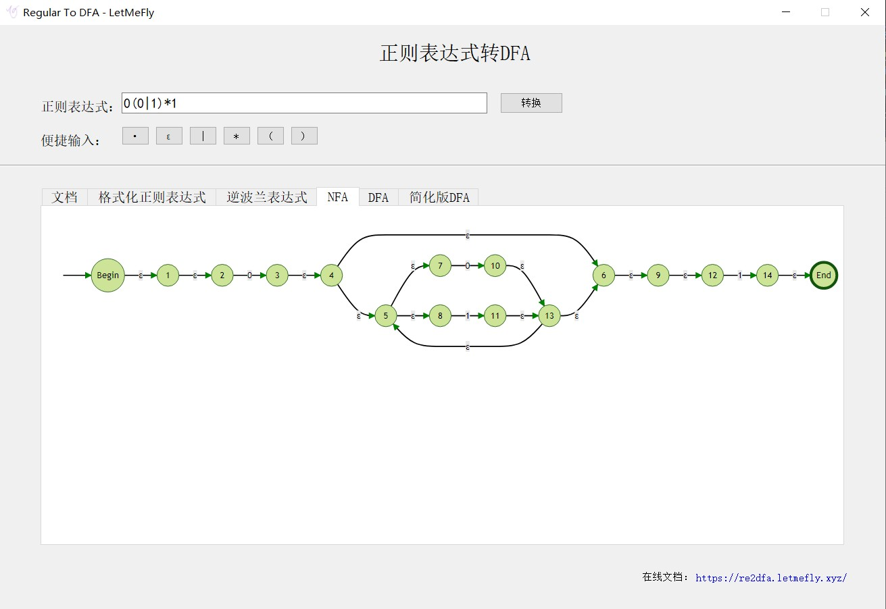
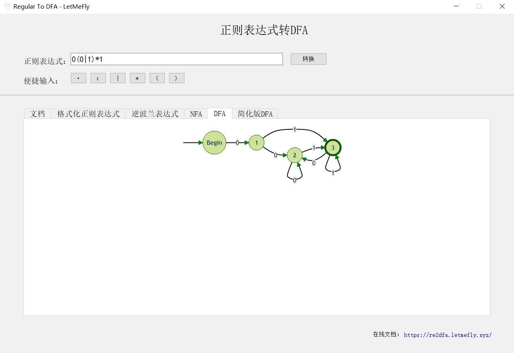
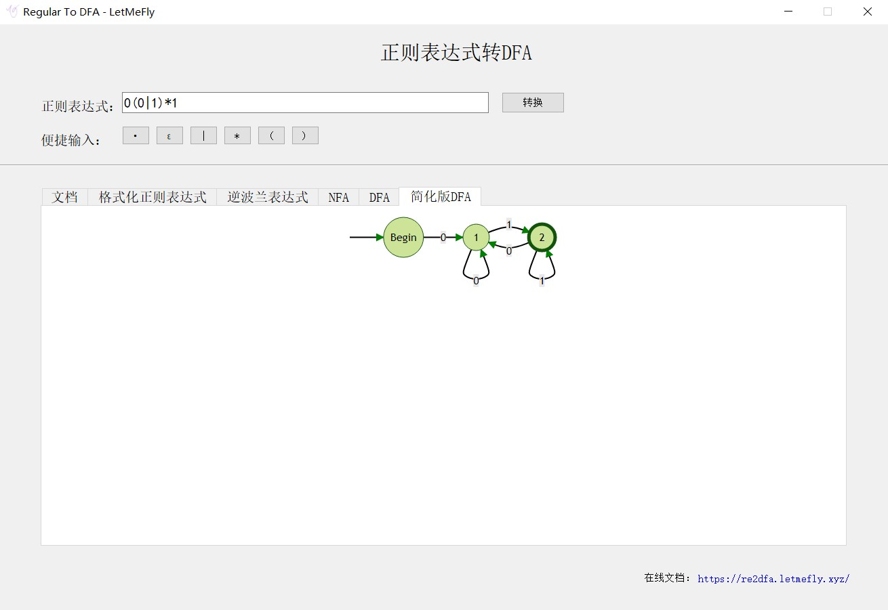

<!--
 * @Author: LetMeFly
 * @Date: 2022-03-28 15:29:51
 * @LastEditors: LetMeFly
 * @LastEditTime: 2022-04-05 15:14:46
-->
# Re2DFA

Regular expression to DFA(Deterministic Finite State)

项目地址：[https://github.com/LetMeFly666/Re2DFA](https://github.com/LetMeFly666/Re2DFA) （预计2022年6月变成public）

**使用方法**

在正则表达式输入框输入正则表达式后，点击“转换”即可。

当前[字符](#Character)、[运算符](#Operator)支持范围详情请点击查看。

若输入不合法等导致程序出错，DFA等栏目将会显示默认状态。详情请看[错误码](#ErrorCode)

以“第一个字符为0，最后一个字符1，由0和1组成的字符串”为例：

运行程序：

主页：



输入前：



输入```0(0|1)*1```并点击```转换```：

NFA：



DFA：



简化DFA：



**编译方法**

在VS中添加QT插件，配置好QT环境后，<code>F5</code>编译运行即可。

**例如**

+ ```0(0|1)*1```
+ ```1|(0(0|1)*1)*```

## 实现目标

输入正则表达式，程序绘制出对应的简化DFA

## 概念

+ [正则表达式](#RegularExpression)
+ [字符](#Character)
+ [实字符](#CharacterReal)
+ [空字符](#CharacterEmpty)
+ [运算符](#Operator)
+ [选择符](#OperatorOr)
+ [连接符](#OperatorConcatenation)
+ [括号符](#OperatorBrackets)
+ [重复符](#OperatorRepetition)
+ [错误码](#ErrorCode)

**@Input**

| 名称       | 类型   | 描述                                           |
| :--------- | ------ | ---------------------------------------------- |
| 正则表达式<a id="RegularExpression"></a> | String | 代表正则表达式的字符串，包括数个[字符](#Character)和[运算符](#Operator)。 |

**字符**

| 名称 | 类型 | 描述                                                         |
| ---- | ---- | ------------------------------------------------------------ |
| 字符<a id="Character"></a> | Char | 代表串中要出现的字符<br/>•支持**实字符**<a id="CharacterReal"></a>```a~z```、```A~Z```、```0~9```<br/>•支持**空字符**<a id="CharacterEmpty"></a>```ε``` |

**运算符**

| 名称   | 类型     | 描述 |
| ------ | -------- | ---- |
| 运算符<a id="Operator"></a> | Operator | 确定正则的运算规则<br/>•支持<a href="#OperatorOr"><font color="black"><b>选择符</b></font></a><code>&#124;</code><br/>•支持<a href="#OperatorConcatenation"><font color="black"><b>连接符</b></font></a>```·```<br/>•支持<a href="#OperatorRepetition"><font color="black"><b>重复符</b></font></a>```*```<br/>•支持<a href="#OperatorBrackets"><font color="black"><b>括号符</b></font></a>```()``` |

| 名称 | 类型 | 描述 |
| ---- | --- | --- |
| 选择符<a id="OperatorOr"></a> | Operator | 若```a```和```b```代表两个正则表达式，则<code>a&#124;b</code>代表```a或b```，即无论是```a```还是```b```都能匹配正则表达式 |
| 连接符<a id="OperatorConcatenation"></a> | Operator | 若```a```和```b```代表两个正则表达式，则```a·b```代表```a后b```（```·```可省略，```a·b```等价于```ab```），即若一个串能从某处分成两串，使得前串匹配```a```且后串匹配```b```，则此串能匹配```a·b``` |
| 重复符<a id="OperatorRepetition"></a> | Operator | 若```a```代表一个正则表达式，则```a*```代表```数个a```（个数n≥0），即若一个串能分成数个串，使得每个串都匹配```a```，则此串能匹配```a*``` |
| 括号符<a id="OperatorBrackets"></a> | Operator | 若```a```代表一个正则表达式，则```(a)```等价于```a```。括号符不能拆开单独使用，但括号符可以提高优先级 |

**优先级** ```()``` > ```*``` > ```·``` > ```|```

**错误码**

<a id="ErrorCode"></a>为了使得用户输入错误表达式时程序不至于崩溃，程序具有了一定程度上的纠错功能。

目前支持以下错误处理：

| 值 | 类型 | 描述 |
| ---- | --- | --- |
| 0 | Int | 无误 |
| 1 | Int | )找不到( |
| 2 | Int | 双目运算符无法出栈两个NFA |
| 3 | Int | 单目运算符无法出栈单个NFA |
| 4 | Int | NFA构建完毕后栈中FNA个数不为一 |
| 5 | Int | 出现不受支持的字符 |
| 6 | Int | 内置文件丢失 |
| 7 | Int | 无写文件权限 |


## 实现思路

输入的正则表达式 → 添加上省略的· → 转换为逆波兰表达式 → 转为NFA → 可视化显示NFA → NFA转为DFA(并可视化) -> 简化DFA(并可视化)

### 添加上省略的·

有以下情况需要在中间添加· ：

```·``` ：194&#124;183

```ε``` ：206&#124;181

程序内部用 ```.``` 代表 ```·``` ，用 ```,``` 代表 ```ε```

+ ab
+ a(
+ )a
+ *b
+ *(

### 逆波兰到NFA

#### 构建NFA

构建NFA栈，从左到右遍历逆波兰表达式：

+ 遇到字母：构建基本NFA入栈
+ 遇到运算符：出栈相应数量的NFA，构建新的NFA入栈

最终栈中剩且仅剩下一个NFA记为最终的NFA

#### NFA的可视化

这里本来准备尝试使用GraphViz。但是放弃的原因有两点：

1. C语言不好配置GraphViz的头文件等，若直接调用编译好的dots.exe则Release需要增加20多M

2. GraphViz生成的图像不太好控制大小方向，且似乎没有颜色

当成功让QT显示了html 且 成功用js生成mermaid图后，决定使用[此项目(https://github.com/mermaid-js/mermaid)](https://github.com/mermaid-js/mermaid)的js将程序生成的源码转成图像。

在此对开源项目的开发者致敬！

#### NFA转为DFA

**思想：** λ（ε）合并、符号合并

初态：Start的ε闭包

每次：走一个Char后求闭包

一个新的状态集为一个DFA

#### 简化DFA

**思想：** 将等价状态合并。

**等价状态：** 初态在同组，经过相同的路径到达的节点也在同组。

**初始分组：** 初始状态将“End节点”、“非End节点”划分为2组。

**编程过程注意：** 

若采用```map<DFA*, int>```来记录每个DFA对应的组号，则迭代过程中要注意不同DFA是否为同组的问题。包括但不限于：

1. 起始状态不在同组但经过相同字符能到达同组的DFA不能划分为同组

2. 由组中不在终态的节点建立的节点的isEnd是false，但同组有End节点的话应修改新节点的isEnd为true。（在1.的条件下似乎不会有2.的情况出现）

## Release

### How To Release

#### 打包QT程序所需依赖

##### 1. QT所需

```bat
windeployqt Re2DFA.exe
```

其中 ```windeployqt``` 可以直接打开```QT的命令行```来使用。或者找到自己电脑上```windeployqt.exe```的位置。例如我电脑```QT安装目录```是```F:\OtherApps\Program\QT\Apps```，安装版本是```msvc2017 x64 5.14.2```，那么我电脑上```windeployqt.exe```就在：```F:\OtherApps\Program\QT\Apps\5.14.2\msvc2017_64\bin\windeployqt.exe```

```bat
"F:\OtherApps\Program\QT\Apps\5.14.2\msvc2017_64\bin\windeployqt.exe" Re2DFA.exe
```

**上述操作最好在一个空的文件夹(With Re2DFA.exe included)中进行。**

##### 2. VS所需

然后添加VS编译出来的程序运行所需要的DLL文件，包括但可能不限于：

1. MSVCP140.dll

2. VCRUNTIME140.dll

3. VCRUNTIME140_1.dll

##### 3. html所需

1. DFA_tail.html

2. DFA_head.html

3. initialDFA.html

4. mermaid.min.js

### 下载发行版

#### DLL、静态文件等依赖

<details>
<summary>QT所需</summary>
<li><a href="https://github.com/LetMeFly666/Re2DFA/releases/download/DLLs%2CStaticFilesAndSoOn/QT.Relaies.zip">QT.Relaies.zip</a></li>
</details>

<details>
<summary>VS所需</summary>
<li><a href="https://github.com/LetMeFly666/Re2DFA/releases/download/DLLs%2CStaticFilesAndSoOn/Dlls.Because.of.Visual.Sutdio.zip">Dlls.Because.of.Visual.Sutdio.zip</a></li>
</details>

<details>
<summary>静态文件</summary>
<li><a href="https://github.com/LetMeFly666/Re2DFA/releases/download/DLLs%2CStaticFilesAndSoOn/HtmlAndJs.zip">HtmlAndJs.zip</a></li>
</details>

#### 发行版

<details>
<summary>v0.0.1-x64</summary>
<li><a href="https://github.com/LetMeFly666/Re2DFA/releases/download/v0.0.1/v0.0.1-x64-Release.zip">v0.0.1-x64-Release.zip</a></li>
<li>单文件：<a href="https://github.com/LetMeFly666/Re2DFA/releases/download/v0.0.1/Re2DFA.exe">Re2DFA.exe</a></li>
</details>

## TODO

### ForBetter

+ 正则表达式与运算过多时，生成的SVG图片可能水平宽度过大，导致图片上的字体非常小

+ 生成的SVG图片无法上下居中（若上下居中，则竖直高度过高时可能无法上下滑动导致内容显示不全）

+ 便捷输入的各个字符按钮点击后只会将字符插入到输入框末尾，而不能插入到光标所在位置

+ 便捷输入的各个字符按钮点击后不会自动聚焦到输入框，而是需要再次点击输入框才能继续按键输入

+ 在缩放比例不是100%的Windows系统上，字体大小会发生变化

### BugFix

```None```
